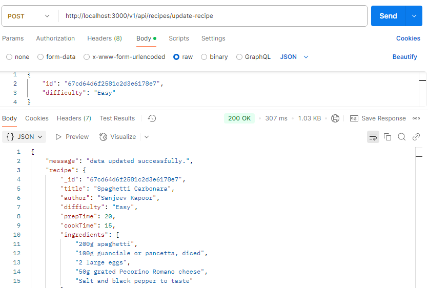
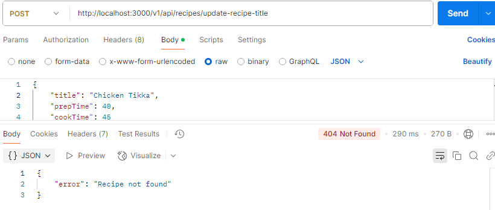

## Recipes App

The Recipes App allows users to create, retrieve, update, and delete recipes. Users can view ingredients, cooking instructions, and images for each recipe.

## 📌 Features

Create a new recipe

Get all recipes

Get a recipe by title

Get all recipes by an author

Get all recipes with 'Easy' difficulty

Update a recipe's difficulty level by ID

Update a recipe's prep time and cook time by title

Delete a recipe by ID

## 🛠 Tech Stack & Dependencies 
**Backend:**
- Node js 
- Express.js - For server setup
- dotenv - For managing environment variables
- MongoDB - use for database
- Mongoose - use for create databse

### 📦 **Installed Packages**
dotenv,
express,
mongoose

## 🚀 How to Set Up for this project ?

1️⃣ Clone the project Repository
``` sh
git clone https://github.com/Mohdsohail7/recipeapp.git
```
after cloning go to project directory using this command
```
cd recipeapp
```

2️⃣ Install Dependencies
``` sh
npm install
```

3️⃣ Start the Server
```sh
npm start
```

## API Endpoints
### Create a Recipe

***Endpoint:*** POST /recipes

*** Request Body:***
```
{
  "title": "Spaghetti Carbonara",
  "author": "Sanjeev Kapoor",
  "difficulty": "Intermediate",
  "prepTime": 20,
  "cookTime": 15,
  "ingredients": [
    "200g spaghetti",
    "100g guanciale or pancetta, diced",
    "2 large eggs",
    "50g grated Pecorino Romano cheese",
    "Salt and black pepper to taste"
  ],
  "instructions": [
    "Cook the spaghetti in boiling salted water until al dente.",
    "Meanwhile, sauté the guanciale or pancetta until crispy.",
    "In a bowl, whisk together eggs and grated cheese.",
    "Drain the spaghetti and immediately toss with the egg mixture and cooked guanciale/pancetta.",
    "Season with salt and pepper. Serve immediately."
  ],
  "imageUrl": "https://example.com/spaghetti_carbonara.jpg"
}
```

*** Response:***
```
{
  "message": "Recipe created successfully",
  "recipe": { ... }
}
```

### Get All Recipes

***Endpoint:*** GET /recipes
*** Response:***
```
[
  {
    "title": "Spaghetti Carbonara",
    "author": "Sanjeev Kapoor",
    "difficulty": "Intermediate",
    "prepTime": 20,
    "cookTime": 15,
    ...
  }
]
```

### Get Recipe by Title
***Endpoint:*** GET /recipes/title/:title
***Response:***
```
{
  "title": "Spaghetti Carbonara",
  "author": "Sanjeev Kapoor",
  "difficulty": "Intermediate",
  "prepTime": 20,
  "cookTime": 15,
  ...
}
```

### Get Recipes by Author
***Endpoint:*** GET /recipes/author/:author
***Response:***
```
[
  {
    "title": "Chicken Tikka Masala",
    "author": "Sanjeev Kapoor",
    ...
  }
]
```

### Get Recipes by Difficulty Level
***Endpoint:*** GET /recipes/difficulty/Easy
***Response:***
```
[
  {
    "title": "Classic Chocolate Chip Cookies",
    "difficulty": "Easy",
    ...
  }
]
```

### Update Recipe Difficulty by ID
***Endpoint:*** POST recipes/update-recipe
***Request Body:***
```
{
  "id": "67cd64d6f2581c2d3e6178e7",
  "difficulty": "Easy"
}
```

***Response:***
```
{
  "message": "Recipe updated successfully"
}
```

### Update Recipe Prep and Cook Time by Title
***Endpoint:*** POST /recipes/update-recipe-title
***Request Body:***
```
{
    "title": "Chicken Tikka",
    "prepTime": 40,
    "cookTime": 45

}
```

***Response:***
```
{
  "message": "Recipe updated successfully"
}
```

### Delete Recipe by ID
***Endpoint:*** POST /recipes/:id/delete-recipe
***Response:***
```
{
  "message": "Recipe deleted successfully"
}
```
### Error Handling
***If a recipe is not found, return:***
```
{
  "error": "Recipe not found"
}
```

*** If there's a server error, return:***
```
{
  "error": "Internal Server Error"
}
```

### Screenshots of the projects








🤝 Contributing
If you want to contribute or add new features, feel free to submit a pull request! 😊

 If you like this project, don't forget to give it a ⭐! 😃

📜 License
This project is licensed under the MIT License.


